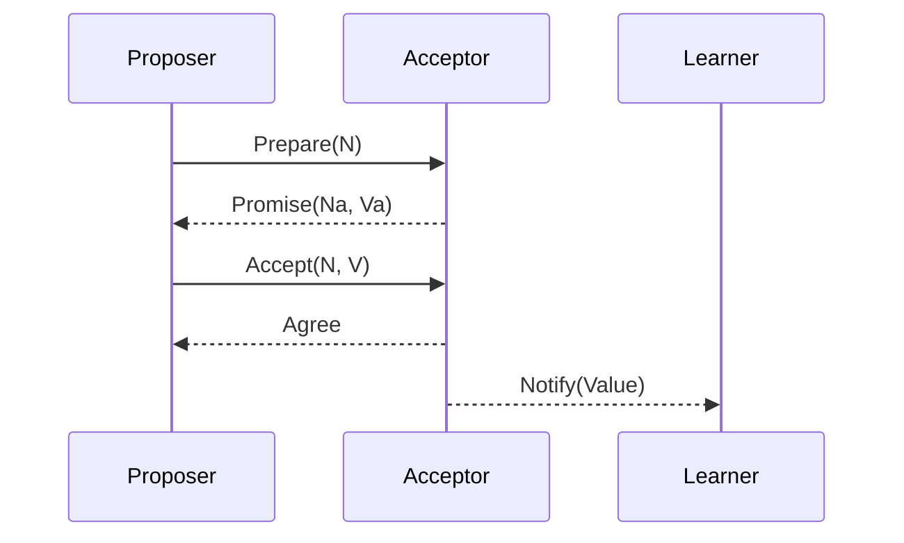

# Distributed Consensus Algorithms Study Notes: Paxos and Raft

This document summarizes the core concepts, processes, roles, advantages, and disadvantages of the Paxos and Raft consensus algorithms. It is suitable for learning and review.

---

## 1. Paxos Consensus Algorithm

Paxos is a consensus algorithm designed for asynchronous distributed systems, providing **safety** and **fault tolerance**. According to the FLP theorem, in a purely asynchronous system, consensus cannot always be guaranteed if node failures exist. Paxos sacrifices some liveness to ensure system safety.

### 1.1 Key Features

- **Safety**: All non-faulty nodes reach a consistent decision, and the decision must come from an actual proposal.
- **No guaranteed liveness**: In extreme asynchronous scenarios, consensus may not be reached immediately.
- **Fault tolerance**: Can tolerate less than half of the nodes failing, and the remaining nodes can still reach consensus.

### 1.2 Role Definitions

| Role        | Description                                                                 |
|-------------|-----------------------------------------------------------------------------|
| **Proposer** | Initiates proposals, broadcasts to Acceptors, and collects votes. There can be multiple Proposers in the system. |
| **Acceptor** | Receives proposals and decides whether to accept them according to rules.   |
| **Learner**  | Observes the final result, does not participate in voting.                 |
| **Leader**   | Elected from among the Proposers, its proposal is adopted by the system.   |

### 1.3 Initialization State

Each node needs to maintain:

- `Na, Va`: The highest proposal number and value accepted  
- `Nh`: The highest proposal number responded to  
- `MYn`: The current round's proposal number  

---

### 1.4 Phase One: Prepare

1. **Proposal Initiation**:  
   - Proposer selects a unique proposal number `MYn > Nh`  
   - Sends `Prepare(N)` to a majority of nodes  

2. **Acceptor Response**:  
   - `N <= Nh` → `Reject`  
   - `N > Nh` → `Promise(Na, Va)` or `Promise(Null, Null)`  
   - Update `Nh = N`  

**Purpose**: Ensure all Acceptors have consensus on the upcoming proposal and provide the Proposer with cluster state information.

---

### 1.5 Phase Two: Accept

1. **Evaluate Responses**:  
   - If a majority of nodes respond positively, select the value with the highest proposal number from the Promises (`Vn`); if all are null, a new value `V` can be chosen  
   - If a Reject is received → return to phase one and re-Prepare with a higher proposal number  

2. **Handle Accept Requests**:  
   - `N > Nh` → Acceptor agrees and updates `Nh, Na, Va`  
   - `N <= Nh` → Acceptor rejects  

**Goal**: Ensure the proposal is accepted by a majority of nodes and prevent interference from old proposals.

---

### 1.6 Common Issues

- **Livelock**: Multiple Proposers overwrite each other, making it impossible to reach stable consensus  

#### Livelock

In the Accept phase of the Paxos algorithm, **livelock** may occur: multiple Proposers initiate proposals simultaneously, overwriting each other, causing the system to fail to reach stable consensus.

**Example**:

Suppose there are three nodes: P1, P2, P3. P1 and P2 are Proposers, P3 is an Acceptor.

1. **Initial State**: P1 and P2 initiate proposals simultaneously  
   - P1 proposal number N1  
   - P2 proposal number N2, where N2 > N1  

2. **Acceptor Response**:  
   - P3 receives N1 → promises Promise(N1)  
   - P3 receives N2 → promises Promise(N2)  

3. **Accept Phase Conflict**:  
   - P1 sends Accept(N1) → rejected by P3 (because N1 < N2)  
   - P1 increases proposal number N3 > N2 → initiates Prepare again  
   - P2 simultaneously initiates a new proposal N4 > N3  

4. **Loop Occurs**: P1 and P2 keep initiating new proposals, overwriting each other, and the system cannot reach stable consensus.

**Solutions**:

- **Fixed Proposer**: Select a fixed node to initiate proposals to reduce competition  
- **Timeout and Randomization**: Different Proposers set random delays to reduce the probability of simultaneous proposals  

- **FLP Theorem Limitation**: In a purely asynchronous faulty environment, termination cannot be guaranteed. Paxos sacrifices liveness to ensure safety.

### 1.7 Pros and Cons

**Pros**:

- Egalitarian mechanism, no privileged nodes  
- Proposal number ordering ensures eventual consistency  
- Majority consensus improves fault tolerance  

**Cons**:

- Algorithm is complex, difficult to understand and implement  
- May be inefficient in practice, requiring improved versions (such as Raft, Multi-Paxos)

---

## 2. Raft Consensus Algorithm

Raft is a log replication consistency algorithm based on Paxos, designed to provide a **protocol that is easy to understand and implement**. Raft breaks down the consistency problem into three subproblems: **leader election, log replication, and safety**.

### 2.1 Node Roles

| Role        | Description                                                        |
|-------------|--------------------------------------------------------------------|
| **Leader**    | Handles client requests, regularly sends heartbeats to prevent elections. |
| **Candidate** | Temporary role during elections, tries to become Leader.         |
| **Follower**  | Default state, receives messages from Leader or Candidate.       |

### 2.2 Time and Terms

- The system is divided into **terms**, each identified by a unique number  
- Each term starts with an election  
- If no Leader is elected, immediately enter the next term

---

### 2.3 Phase One: Leader Election

1. **Start Election**:  
   - Follower does not receive heartbeat → becomes Candidate → increases term number → votes for itself → requests votes from other nodes  

2. **Election Result**:  
   - Wins majority votes → becomes Leader → regularly sends heartbeats  
   - Receives heartbeat with higher term → acknowledges new Leader → returns to Follower  
   - If no winner → retries after random delay

---

### 2.4 Phase Two: Log Replication

1. **Client request** → Leader adds to log entry  
2. **Leader broadcasts AppendEntries** → Followers replicate log  
3. **Majority of nodes replicate successfully** → log can be committed and applied to the state machine  

**Purpose**: Ensure log consistency and system reliability

---

### 2.5 Phase Three: Leader Disconnection

- If network partition causes Leader to lose contact with the majority → new Leader is elected  
- Old Leader re-joins and steps down to Follower  
- Log updates during old Leader's isolation are invalidated, ensuring consistency  

---

### 2.6 Raft Features

- Easy to understand and implement  
- Clear roles and terms  
- Highly reliable log replication  
- Widely used in consortium chains, private chains, and distributed systems

---

## 3. Summary Comparison

| Algorithm | Pros                              | Cons                                      |
|-----------|-----------------------------------|-------------------------------------------|
| **Paxos** | High safety, strong fault tolerance | Complex algorithm, difficult to implement, limited liveness |
| **Raft**  | Easy to understand and implement, clear log consistency | May need communication optimization in large-scale systems |

---

## 4. Mermaid Flowchart Example

