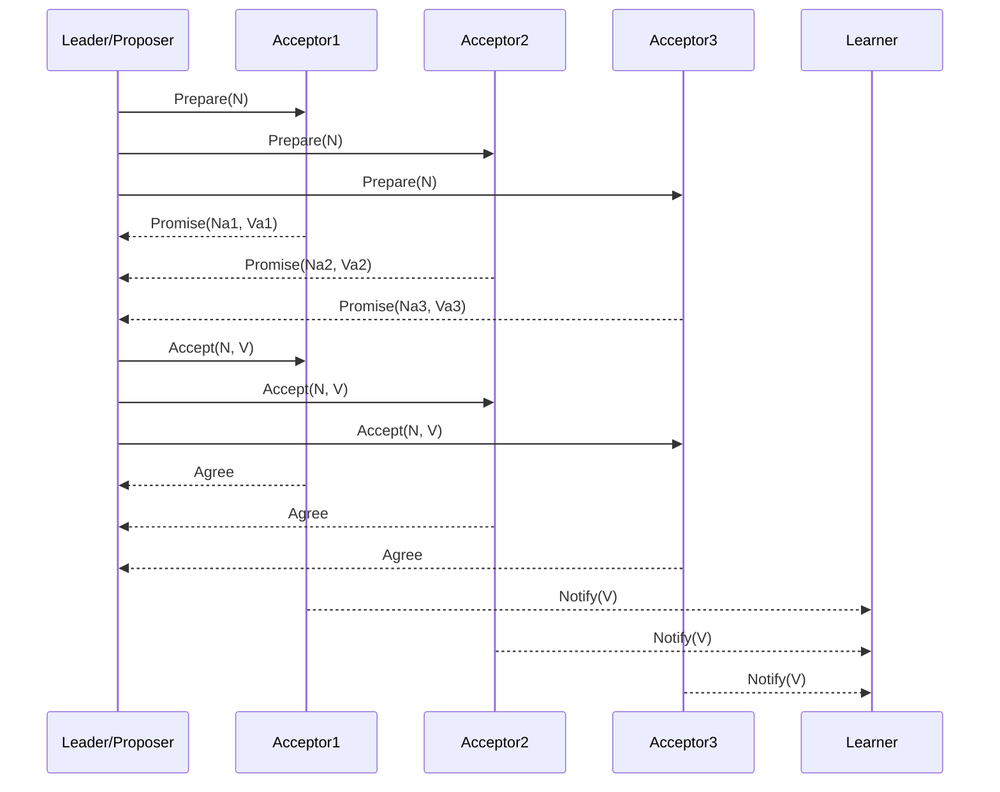

# 分布式共识算法学习笔记：Paxos 与 Raft

本文档整理了 Paxos 和 Raft 共识算法的核心概念、流程、角色、优缺点，适合用于学习和复习。

---

## 1. Paxos 共识算法

Paxos 是一种在异步分布式系统下设计的共识算法，提供 **安全性** 与 **容错性**。根据 FLP 定理，在纯异步系统中，如果存在节点故障，则无法保证共识算法始终终止。Paxos 在设计上牺牲了一部分活性（Liveness），以确保系统安全性（Safety）。

### 1.1 关键特性

- **安全性 (Safety)**：所有非故障节点达成一致决策，决策必须来自实际提议。
- **无保证的终止性 (Liveness)**：在极端异步情况下可能无法立即达成共识。
- **容错性 (Fault Tolerance)**：可容忍少于半数节点宕机，剩余节点仍能达成共识。

### 1.2 角色定义

| 角色 | 说明 |
|------|------|
| **Proposer（提议者）** | 发起提案，广播给 Acceptor 并收集投票。系统中可有多个 Proposer。 |
| **Acceptor（接受者）** | 接收提议并根据规则决定是否接受。 |
| **Learner（学习者）** | 观察最终结果，不参与投票。 |
| **Leader（领导者）** | 从 Proposer 中选出的领导者，其提案被系统采纳。 |

### 1.3 初始化状态

每个节点需维护：

- `Na, Va`：已接受的最大提案号及值  
- `Nh`：已响应的最大提案号  
- `MYn`：当前轮提案号  

---

### 1.4 阶段一：准备阶段 (Prepare)

1. **提案发起**：  
   - Proposer 选择唯一提案号 `MYn > Nh`  
   - 向多数节点发送 `Prepare(N)`  

2. **Acceptor 响应**：  
   - `N <= Nh` → `Reject`  
   - `N > Nh` → `Promise(Na, Va)` 或 `Promise(Null, Null)`  
   - 更新 `Nh = N`  

**目的**：让所有 Acceptor 对即将投票的提案有共识，为 Proposer 提供集群状态信息。

---

### 1.5 阶段二：接受阶段 (Accept)

1. **评估响应**：  
   - 若过半节点正面响应，从 Promise 中选择最大编号提案值 `Vn`；若全为空则可选择新值 `V`  
   - 若收到 Reject → 返回阶段一，使用更高提案号重新 Prepare  

2. **处理 Accept 请求**：  
   - `N > Nh` → Acceptor 同意并更新 `Nh, Na, Va`  
   - `N <= Nh` → Acceptor 拒绝  

**目标**：确保提案被多数节点接受，防止旧提案干扰。

---

### 1.6 常见问题

- **活锁 (Livelock)**：多个 Proposer 相互覆盖导致无法达成稳定共识  

在 Paxos 算法的接受阶段，可能出现 **活锁**：多个 Proposer 同时发起提案，相互覆盖，导致系统无法进入稳定共识状态。

**实例说明**：

假设有三个节点：P1、P2、P3，P1 和 P2 都是 Proposer，P3 是 Acceptor。

1. **初始状态**：P1 和 P2 同时发起提案  
   - P1 提案编号 N1  
   - P2 提案编号 N2，其中 N2 > N1  

2. **Acceptor 响应**：  
   - P3 收到 N1 → 承诺 Promise(N1)  
   - P3 收到 N2 → 承诺 Promise(N2)  

3. **Accept 阶段冲突**：  
   - P1 发送 Accept(N1) → 被 P3 拒绝（因 N1 < N2）  
   - P1 增加提案号 N3 > N2 → 再次发起 Prepare  
   - P2 同时发起新提案 N4 > N3  

4. **循环发生**：P1 和 P2 不断发起新提案，互相覆盖，系统无法达成稳定共识。

**解决策略**：

- **固定 Proposer**：选一个固定节点发起提案，减少竞争  
- **超时与随机化**：不同 Proposer 设置随机延时，降低同时发起提案的概率  

- **FLP 定理限制**：无法在纯异步故障环境下保证终止性，Paxos 牺牲活性以保证安全性。

### 1.7 优缺点

**优点**：

- 平等机制，无特权节点  
- 提案编号排序，保证最终一致性  
- 多数派共识，提高容错性  

**缺点**：

- 算法复杂，难以理解与实现  
- 实践中可能效率低，需要改进版本（如 Raft、Multi-Paxos）

---

## 2. Raft 共识算法

Raft 是基于 Paxos 的日志复制一致性算法，旨在提供 **易理解、易实现** 的协议。Raft 将一致性问题拆分为三个子问题：**领导选举、日志复制、安全性**。

### 2.1 节点角色

| 角色 | 说明 |
|------|------|
| **Leader** | 处理客户端请求，定期发送心跳阻止选举。 |
| **Candidate** | 在选举阶段临时角色，尝试成为 Leader。 |
| **Follower** | 默认状态，接收 Leader 或 Candidate 消息。 |

### 2.2 时间与任期

- 系统按**任期 (term)** 划分，唯一编号标识  
- 每任期开始进行一次选举  
- 若选举未产生 Leader，立即进入下一任期

---

### 2.3 阶段一：Leader 选举

1. **启动选举**：  
   - Follower 未收到心跳 → 变 Candidate → 增加任期号 → 自投票 → 向其他节点请求投票  

2. **选举结果**：  
   - 获得过半票 → 成为 Leader → 定期发送心跳  
   - 收到更高任期心跳 → 承认新 Leader → 回到 Follower  
   - 若无胜出 → 随机延时重试

---

### 2.4 阶段二：日志复制

1. **客户端请求** → Leader 添加到日志条目  
2. **Leader 广播 AppendEntries** → Follower 复制日志  
3. **多数节点复制成功** → 日志可提交，应用到状态机  

**目的**：保证日志一致性，确保系统可靠性

---

### 2.5 阶段三：Leader 失联

- 若网络分区导致 Leader 与多数节点失联 → 新选举产生 Leader  
- 旧 Leader 重新连接后退为 Follower  
- 旧 Leader 期间的日志更新失效，保证一致性  

---

### 2.6 Raft 特点

- 易理解、易实现  
- 明确角色与任期  
- 高可靠性日志复制  
- 广泛应用于联盟链、私链及分布式系统

---

## 3. 总结对比

| 算法 | 优点 | 缺点 |
|------|------|------|
| **Paxos** | 高安全性、容错能力强 | 算法复杂、实现难、活性有限 |
| **Raft** | 易理解、易实现、日志一致性明确 | 在大规模系统下可能需要优化通信效率 |

---

## 4. Mermaid 流程图示例

